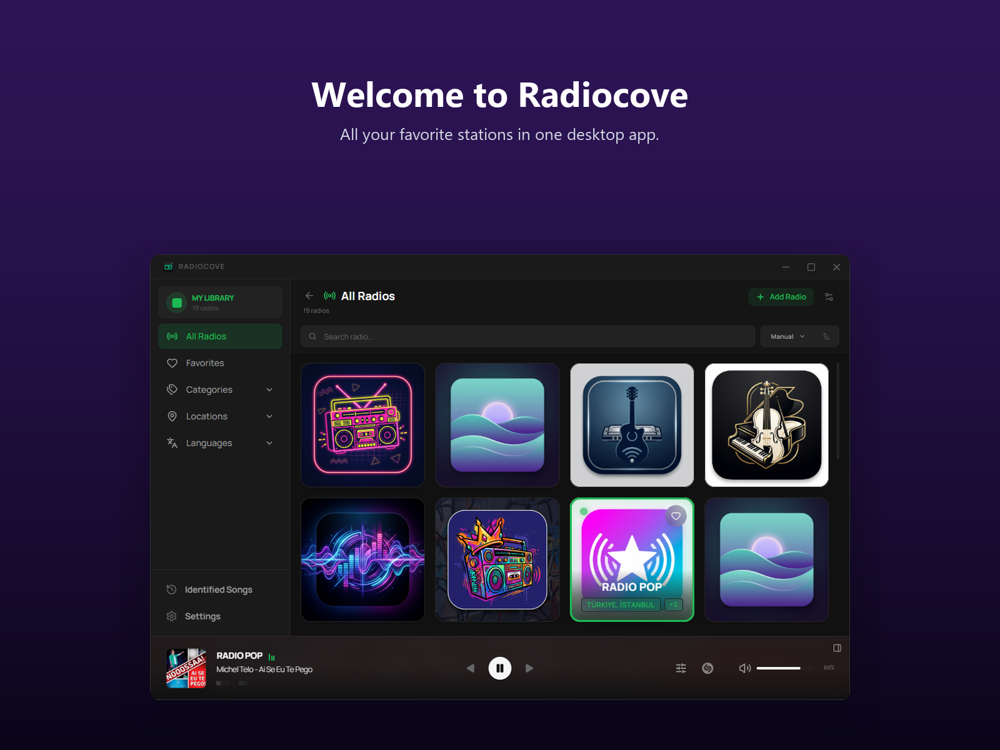
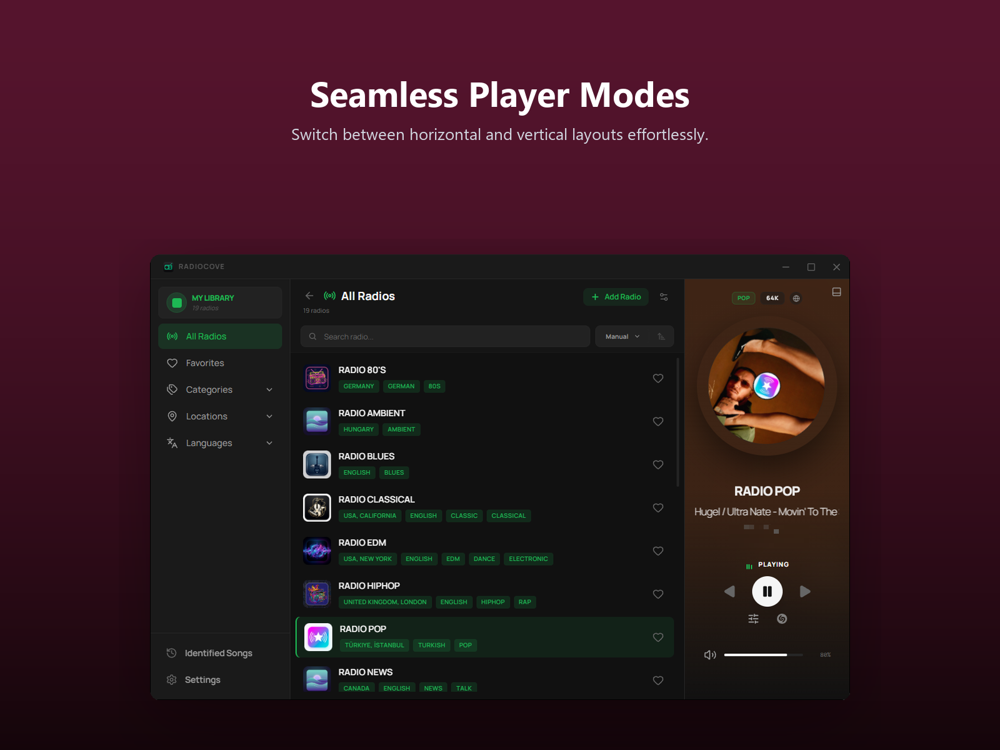
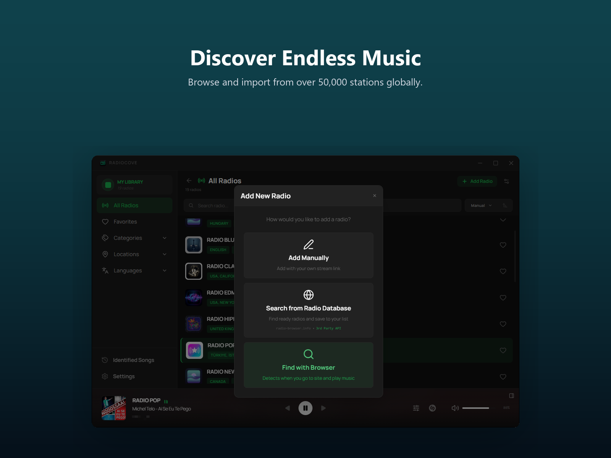
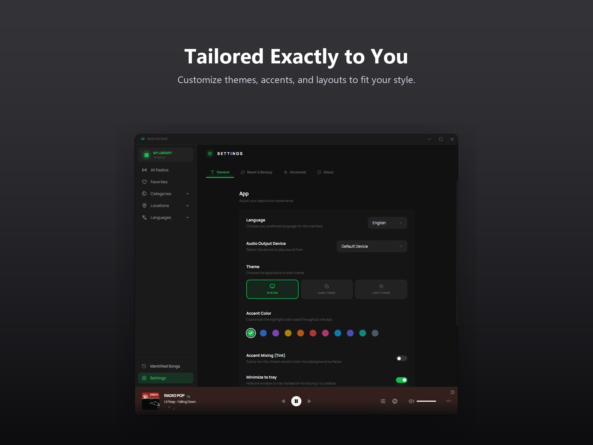
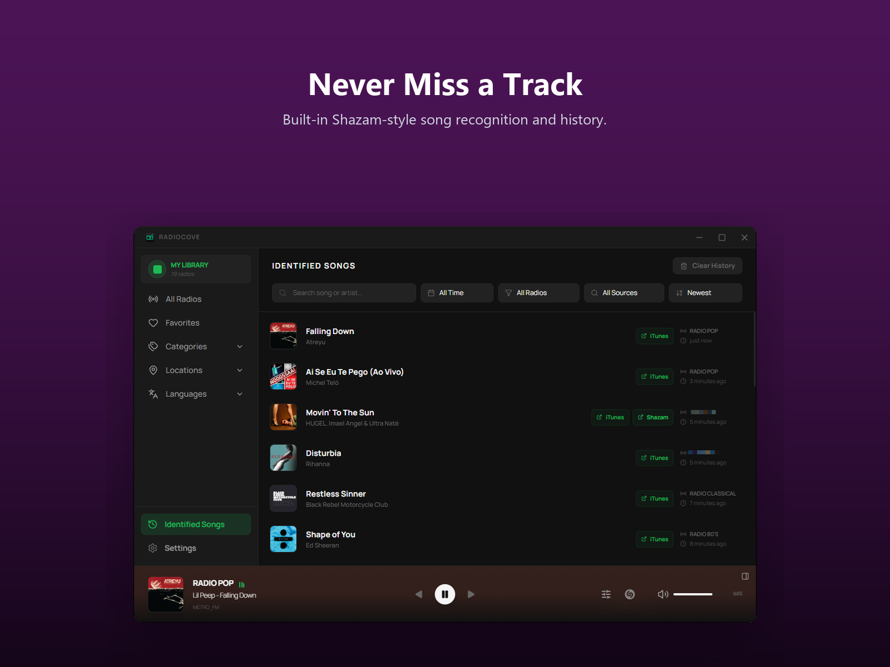

<div align="center">
  
  <h1>Radiocove</h1>
  <p>Desktop radio client built with Tauri 2 + React</p>

  [](https://www.gnu.org/licenses/gpl-3.0)
  [](https://github.com/xacnio/radiocove/releases)

  [](https://apps.microsoft.com/detail/9NKTF92G6XFQ)
</div>

---

Radiocove is a desktop radio player. You can browse stations, add your own streams, identify songs with built-in recognition, and customize pretty much everything. It's fast, looks good, and stays out of your way.

> [!IMPORTANT]
> Radiocove doesn't host or broadcast anything. It's just a player. You add the streams, we play them.

## Install

Radiocove is free and open-source. You can purchase it on the Microsoft Store to support the developer, or get it for free from GitHub.

> [!NOTE]
> On Windows, GitHub builds aren't signed with a paid certificate and may get flagged by antivirus software. Installing from the Microsoft Store is recommended.

Grab the latest build from [Releases](https://github.com/xacnio/radiocove/releases/latest), or use a platform store/link below:

| Platform | Architecture | Formats | Store / Link |
| :--- | :--- | :--- | :--- |
| Windows (10+) | x64 | `.exe` installer, `.msi` | [Microsoft Store](https://apps.microsoft.com/detail/9NKTF92G6XFQ) / [Releases](https://github.com/xacnio/radiocove/releases/latest) |
| Windows (10+) | ARM64 | `.exe` installer | [Microsoft Store](https://apps.microsoft.com/detail/9NKTF92G6XFQ) / [Releases](https://github.com/xacnio/radiocove/releases/latest) |
| macOS (11+) | Universal (Intel + Apple Silicon) | `.dmg` | [Releases](https://github.com/xacnio/radiocove/releases/latest) |
| Linux | x64 | `.deb`, `.rpm`, `.AppImage` | [Releases](https://github.com/xacnio/radiocove/releases/latest) |
| Linux | ARM64 | `.deb`, `.rpm` | [Releases](https://github.com/xacnio/radiocove/releases/latest) |

Windows 7/8 is not supported (no WebView2).

## Screenshots

<div align="center">
  
</div>

<details>
<summary><b>✨ Click here to view more Screenshots & GUI Features</b></summary>
<br>

| Responsive Layouts | Discover & Organize |
| :---: | :---: |
|  |  |
| **Settings & Control** | **Identified Songs History** |
|  |  |

</details>

## Features

**📻 Station Management**
- Add custom stations via stream URL or built-in browser detection
- Favorites, drag & drop manual sorting
- Quick Image — auto-fetch station artwork from the web
- Built-in browser — visit any website and auto-detect playing streams
- Browse and import from 50,000+ stations via [radio-browser.info](https://www.radio-browser.info) — filter by country, language, genre

**🎵 Playback & Audio**
- Built-in equalizer with presets (Bass, Rock, Pop, Classic, Vocal, etc.)
- Live stream metadata display (song title, artist, codec, bitrate)
- iTunes metadata enrichment — auto-fetches album art, artist info, and listen links from stream metadata
- Live listener count and popularity stats

**🎤 Song Recognition**
- Shazam-style song identification powered by [SongRec](https://github.com/marin-m/SongRec)
- Auto-identify mode — continuously recognizes songs as they play
- Identified Songs history with search, filters (date, station, source), and listen links

**🎨 Customization**
- Dark / Light / System theme with accent color picker
- Accent tint mixing into background surfaces
- List view and grid view layouts
- Resizable sidebar and player panels
- Vertical and horizontal player modes
- Responsive layout — adapts to any window size

**🌍 Internationalization**
- Multi-language interface (English, Türkçe, Deutsch)
- All UI text and tooltips localized, including native splash screen

**💻 Platform Integration**
- OS media transport controls (Windows SMTC, macOS/Linux MPRIS)
- Windows taskbar thumbnail buttons (Previous / Play-Pause / Next)
- Discord Rich Presence — show what you're listening to on Discord
- Backup & restore all data as a single .zip file
- Built-in auto-updater

## Build from source

```bash
git clone https://github.com/xacnio/radiocove
cd radiocove
npm install
npm run tauri dev
```

Requires [Rust](https://rustup.rs/), [Node.js](https://nodejs.org/), and platform-specific deps for Tauri — see [Tauri prerequisites](https://v2.tauri.app/start/prerequisites/).

## Disclaimer

Radiocove is a client application. It does not provide, curate, or host any radio content. Users are responsible for the streams they add. Station discovery is powered by [radio-browser.info](https://www.radio-browser.info), a community-driven database — we're not affiliated with them.

This app uses third-party services for certain features: Shazam (song recognition), Apple Music / iTunes (metadata enrichment), and Google (image search). Radiocove is not affiliated with or endorsed by any of these services. Their use is subject to their respective terms of service.

Users can share station lists via backup files. We take no responsibility for shared content.

## Built with

| Project | Description | License |
| :--- | :--- | :--- |
| [SongRec](https://github.com/marin-m/SongRec) | Open-source Shazam client and library | GPL-3.0 |
| [radio-browser.info](https://www.radio-browser.info) | Community-driven radio station database | GPL-3.0 |
| [Tauri](https://tauri.app) | Lightweight desktop app framework | MIT |
| [Symphonia](https://github.com/pdeljanov/Symphonia) | Pure Rust audio decoding library | MPL-2.0 |
| [discord-rich-presence](https://github.com/vionya/discord-rich-presence) | Discord Rich Presence library for Rust | MIT |

## AI Disclosure

This project was initially developed with the assistance of AI-powered coding tools (such as Claude/Gemini and similar LLM-based agents) to accelerate the path to a first stable release. Throughout this process, all generated code was reviewed, validated, and guided by the developer's own software engineering knowledge.

Going forward, the project's maintenance, stability improvements, and new features will be driven primarily through conventional development practices, with AI tools used only as supplementary aids where appropriate.

## License

[GPL-3.0](LICENSE)

## Privacy Policy

[Privacy Policy](PRIVACY.md)
